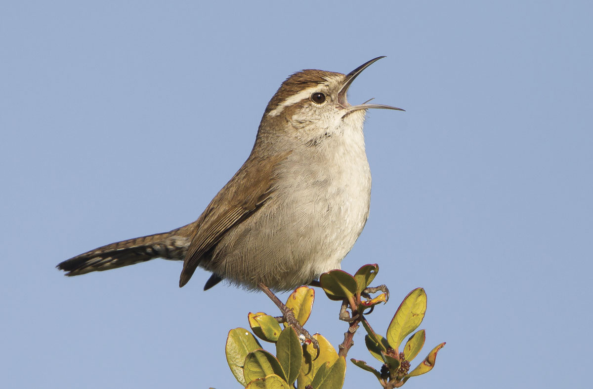

Hello my name is Max Ptero’dactyl Aves Plumage Wren. I have long brown feathers (that’s how I got my name) with reddish-brown stripes that reach my tail and jet black eyes like onyx beads and a lot of people tell me I look like Jeff Mangum (AN: if u don‘t know who he is get da hell out of here!).

(Picture of a Bewick's wren [by Steve Zamek](https://www.featherlightphoto.com/bewicks-wren/h52289c7e))
